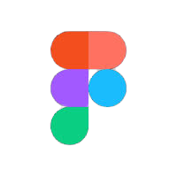

  

   
   
 <h3 style="font-size:30px">What`s up guys, I`m Nilo!👋
<h3>
 

  
 

<h1 align="center">✨  About Me </h1>
  <section style= "display:flex; gap:10px">
  

  
  <ul>
  I`m a newly graduated IT technician from Senac RJ. At 20 years old, with a passion for creating web solutions, I am embarking on a journey to become a web developer. 
  Here on GitHub, you will find a variety of projects I am working on to enhance my skills as a web developer. I am committed to building interesting and functional applications, applying best development practices, and constantly learning from each project I complete.
   
   
    <li>💻 Interests:  Full-stack development and programming a little bit of all.</li>
    <li>🌱 Currently, I am honing my skills in React, Ionic, and Angular.</li>
    <li>🌐  I am to specialize in full-stack web development to create modern and responsive applications.</li>
    <li>📚 I am always learning and keeping up with the latest trends and technologies in the web industry.</li>
     
    Feel free to explore my work and follow my progress as a web developer. I am excited to build an exciting future in the field of web development and share my knowledge with the community here on GitHub.
     
     
    Stay here to witness my progress 😎
  </ul>
  
 
  

   
  

  </section>
   

<h1 align="center">🛠️Languangues and Tools </h1>  

    
     
     
     
    
    
    
    
    
    
     
    
    
    
    
    
    
    
   

    
    
    
  <section style="display:flex;gap:20px">
  <h1 align="center">📈 GitHub Stats</h1>
  

  
  

  

  
  

</section>

 
 
 

<section align="center">  
  <h1 align="center">🔗Connect with me</h1>
    
    
    
</section>

 
 
 
  

  

   
   
 <h3 style="font-size:30px">What`s up guys, I`m Nilo!👋
<h3>
 

  
 

<h1 align="center">✨  About Me </h1>
  <section style= "display:flex; gap:10px">
  

  
  <ul>
  I`m a newly graduated IT technician from Senac RJ. At 20 years old, with a passion for creating web solutions, I am embarking on a journey to become a web developer. 
  Here on GitHub, you will find a variety of projects I am working on to enhance my skills as a web developer. I am committed to building interesting and functional applications, applying best development practices, and constantly learning from each project I complete.
   
   
    <li>💻 Interests:  Full-stack development and programming a little bit of all.</li>
    <li>🌱 Currently, I am honing my skills in React, Ionic, and Angular.</li>
    <li>🌐  I am to specialize in full-stack web development to create modern and responsive applications.</li>
    <li>📚 I am always learning and keeping up with the latest trends and technologies in the web industry.</li>
     
    Feel free to explore my work and follow my progress as a web developer. I am excited to build an exciting future in the field of web development and share my knowledge with the community here on GitHub.
     
     
    Stay here to witness my progress 😎
  </ul>
  
 
  

   
  

  </section>
   

<h1 align="center">🛠️Languangues and Tools </h1>  

    
     
     
     
    
    
    
    
    
    
     
    
    
    
    
    
    
    
   

    
    
    
  <section style="display:flex;gap:20px">
  <h1 align="center">📈 GitHub Stats</h1>
  

  
  

  

  
  

</section>

 
 
 

<section align="center">  
  <h1 align="center">🔗Connect with me</h1>
    
    
    
</section>

 
 
 
  

  

   
   
 <h3 style="font-size:30px">What`s up guys, I`m Nilo!👋
<h3>
 

  
 

<h1 align="center">✨  About Me </h1>
  <section style= "display:flex; gap:10px">
  

  
  <ul>
  I`m a newly graduated IT technician from Senac RJ. At 20 years old, with a passion for creating web solutions, I am embarking on a journey to become a web developer. 
  Here on GitHub, you will find a variety of projects I am working on to enhance my skills as a web developer. I am committed to building interesting and functional applications, applying best development practices, and constantly learning from each project I complete.
   
   
    <li>💻 Interests:  Full-stack development and programming a little bit of all.</li>
    <li>🌱 Currently, I am honing my skills in React, Ionic, and Angular.</li>
    <li>🌐  I am to specialize in full-stack web development to create modern and responsive applications.</li>
    <li>📚 I am always learning and keeping up with the latest trends and technologies in the web industry.</li>
     
    Feel free to explore my work and follow my progress as a web developer. I am excited to build an exciting future in the field of web development and share my knowledge with the community here on GitHub.
     
     
    Stay here to witness my progress 😎
  </ul>
  
 
  

   
  

  </section>
   

<h1 align="center">🛠️Languangues and Tools </h1>  

    
     
     
     
    
    
    
    
    
    
     
    
    
    
    
    
    
    
   

    
    
    
  <section style="display:flex;gap:20px">
  <h1 align="center">📈 GitHub Stats</h1>
  

  
  

  

  
  

</section>

 
 
 

<section align="center">  
  <h1 align="center">🔗Connect with me</h1>
    
    
    
</section>

 
 
 
  

